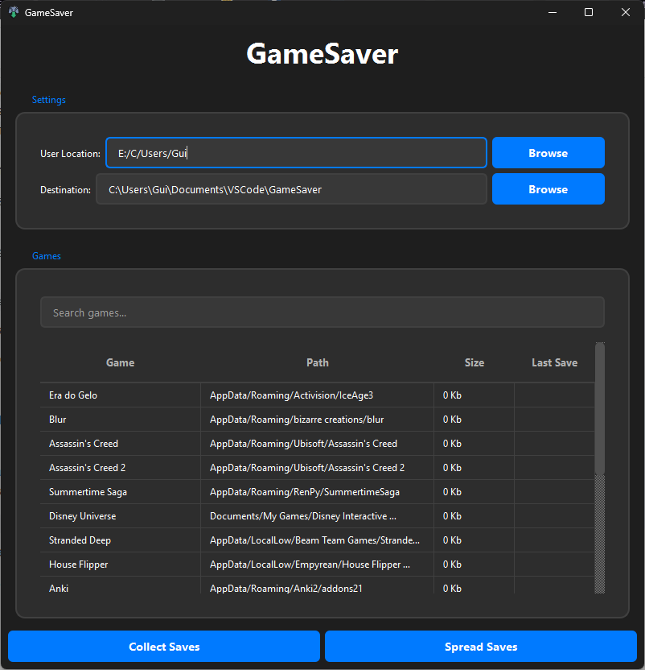

# 🎮 GameSaver - Manage Your Game Saves with Ease



## 📌 About the Project

**GameSaver** is a powerful tool for managing saves from all detected games on your computer. It allows you to:

- ✅ **Automatically back up** all detected game saves.
- ✅ **Quickly restore** saves to prevent progress loss.
- ✅ **User-friendly** configuration through JSON files.
- ✅ **Synchronize** a custom save folder with respective games.
- ✅ **Support multiple games**, ensuring compatibility across various platforms.

### 🕹️ Example Use Case

Imagine you are playing multiple local games, and you want to ensure your progress is backed up in case of a system crash. With **GameSaver**, you can:

- Run a **single command** to collect and back up all your saves.
- Easily restore your saves whenever needed.
- Share your progress across multiple devices by syncing your save files.

## 🚀 How It Works?

GameSaver scans your computer for game saves and organizes them efficiently. It can also distribute previously stored saves to the respective game directories, ensuring you always have your progress safe and available. You can manually add any path and it will save the corresponding folder.


## 🛠️ Technologies Used

- **Python 3.13.2**
- **Libraries:** `os`, `sys`, `shutil`, `json`, `PyQt6`

## 📋 System Requirements

- **Operating System:** Windows/Linux/macOS
- **Python Version:** 3.6 or later
- **Disk Space:** At least 100MB free for backups
- **Permissions:** Admin privileges may be required to access certain game directories

## 📥 Installation

> Install the **pre-built executable** at [Releases](https://github.com/GuilhermeRoesler/GameSaver/releases) section on **GitHub** and **run it!**

---

But if you don't want to install the **pre-built executable**, you can run it **locally**, as taught **below**:

1. **Clone this repository:**
   ```sh
   git clone https://github.com/GuilhermeRoesler/GameSaver.git
   cd GameSaver
   ```
2. **Install the required dependencies:**
   ```sh
   pip install -r requirements.txt
   ```
3. **Run the script:**
   ```sh
   python main.py
   ```

## ⚙️ Configuration

### Settings (settings.json)

The application uses a settings file that contains:

- `user_location`: Path to your user directory (default is **home** directory)
- `destination_location`: Where save backups will be stored
- `mode`: Operation mode (`collect` or `spread`)

### Games Database (games.json)

Add your games in the following format:

```json
{
  "game": "Game Name",
  "path": "\\AppData\\Roaming\\YourGame",
  "last_save": ""
}
```

## 🎛️ How to Use?

1. **Launch the application**
2. **Verify/modify the default settings when prompted**
3. **Choose operation mode:**
   - `collect`: Backup save files
   - `spread`: Restore save files (coming soon)
4. **Confirm the operation!**

## 🎲 Supported Games

The tool comes with a pre-configured database of common games. You can add more games by editing the `games.json` file.

## 📂 Project Structure

```
GameSaver/
│── main.py              # Main script of the program
│── settings.py          # Manages configurations and user settings
│── game_manager.py      # Detects and organizes game save files
│── file_handler.py      # Handles file operations like copying and moving
│── utils.py             # Utility functions (logging, error handling, etc.)
│── constants.py         # Global constants and variables
│── games_database.json  # Predefined list of common game save locations
│── requirements.txt     # Dependency list for installation
│── imgs/                # Folder containing UI or project images
│── README.md            # Project documentation
```

## 💾 Creating the Executable

If you don’t want to download the **pre-built executable** available in the **Releases** section on [GitHub](https://github.com/GuilhermeRoesler/GameSaver/releases), you can create your own using Python's `pyinstaller` library. To do so, first install it:

```sh
pip install pyinstaller
```

Then, open the project folder and **run**:

```sh
pyinstaller --onefile --add-data "games_database.json;." .\main.py
```

This will generate some folders. Open the `dist` folder, and you should find the **ready-to-use executable**. If everything is set up correctly, your executable should run without issues! 🎉

## ❗ Notes & FAQ

### ❓ What if my game is not detected?

Some games store save files in custom locations. You may need to manually add them to `games_database.json`.

### ❓ Can I sync my saves between multiple devices?

Yes! You can store your backed-up saves in a cloud service like Google Drive or OneDrive and restore them on another device.

### ❓ Does GameSaver support online games?

GameSaver primarily works with local saves. Online-only games that store progress in the cloud may not be compatible.

## 🤝 Contribution

Contributions are welcome! Follow these steps:

1. Fork this repository.
2. Create a new branch (`git checkout -b feature-my-feature`).
3. Commit your changes (`git commit -m 'Add my feature'`).
4. Push to the branch (`git push origin feature-my-feature`).
5. Open a Pull Request.

---

Developed with 💙 by [Guilherme Roesler](https://github.com/GuilhermeRoesler)
