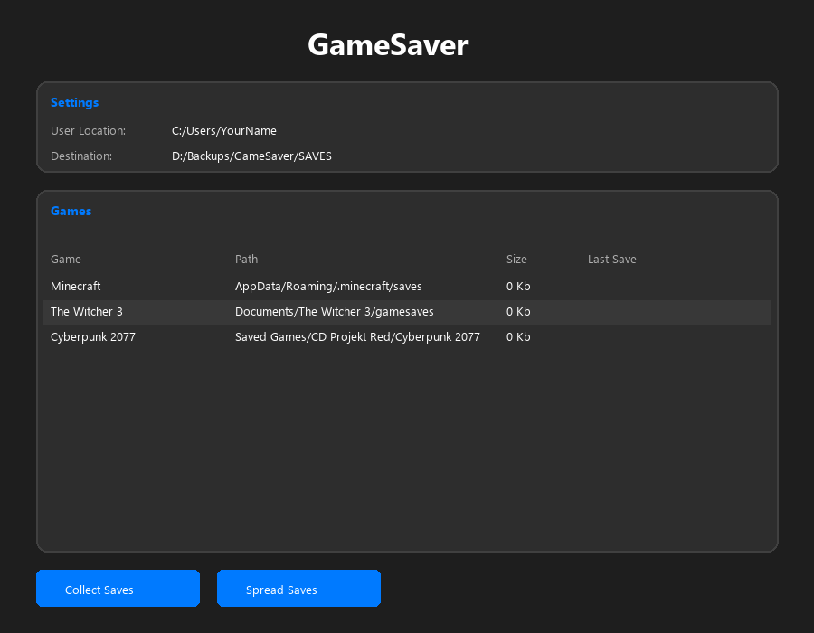
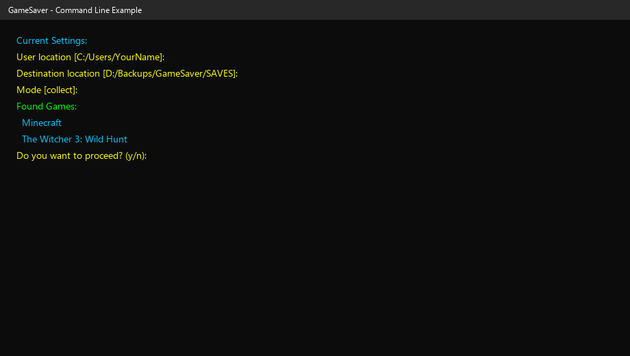

# 🎮 GameSaver - Manage Your Game Saves with Ease

<p align="center">
   
</p>

## 📌 About the Project

**GameSaver** is a desktop tool for managing local game save files on Windows, Linux, and macOS. It detects installed games, backs up their save folders to a central destination, and (in a future release) restores them.

### Current features

| Feature | Status |
|---------|--------|
| Detect installed games from a built-in database | ✅ |
| Backup saves (`collect` mode) | ✅ |
| Graphical interface (PyQt6) | ✅ Default |
| Command-line interface (colorama) | ✅ Alternative |
| Search and multi-select games in the GUI | ✅ |
| Path safety validation | ✅ |
| Restore saves (`spread` mode) | ✅ |

With **GameSaver**, you can:

- Back up detected game saves to a single folder.
- Add custom games via `games.json`.
- Sync your backup folder through cloud storage (Google Drive, OneDrive, etc.) and restore on another machine once `spread` is available.



## 🚀 How It Works

1. Set your **user location** (home directory) and **destination** (backup folder, default `SAVES/`).
2. GameSaver checks which game save paths exist under your user location.
3. In **collect** mode, selected save folders are copied to the destination.
4. In **spread** mode, backed-up saves are copied back to their original game directories.

Paths are relative to your home directory and validated to prevent overly broad copies (e.g. entire `AppData` or `Documents` folders).

## 🛠️ Technologies

- **Python 3.11+** (CI tests 3.11, 3.12, 3.13)
- **PyQt6** — graphical interface
- **colorama** — colored CLI output
- **pytest** + **ruff** — tests and lint (development)

## 📋 System Requirements

- **Operating System:** Windows / Linux / macOS
- **Python Version:** 3.11 or later (for local development)
- **Disk Space:** Depends on your save files
- **Permissions:** Some game directories may require elevated access

## 📥 Installation

> Download the **pre-built executable** from [Releases](https://github.com/GuilhermeRoesler/GameSaver/releases) and run it.

### Run from source

1. **Clone this repository:**
   ```sh
   git clone https://github.com/GuilhermeRoesler/GameSaver.git
   cd GameSaver
   ```
2. **Install dependencies:**
   ```sh
   pip install -r requirements.txt
   ```
3. **Run the application:**
   ```sh
   python -m gamesaver
   ```

   On first run, `settings.json` and `games.json` are created automatically.

### Quick start scripts

- **Windows:** `run.bat`
- **Linux/macOS:** `run.sh`

These scripts create a virtual environment, install dependencies, and launch the app.

## ⚙️ Configuration

### Settings (`settings.json`)

Created automatically on first run:

```json
{
  "user_location": "C:/Users/YourName",
  "destination_location": "C:/path/to/GameSaver/SAVES",
  "mode": "collect"
}
```

| Field | Description |
|-------|-------------|
| `user_location` | Your home/user directory (save paths are relative to this) |
| `destination_location` | Where backups are stored |
| `mode` | `collect` (backup) or `spread` (restore) |

### Games database

Game entries use forward slashes, relative to `user_location`:

```json
{
  "game": "Game Name",
  "path": "AppData/Roaming/YourGame",
  "last_save": ""
}
```

| File | Purpose |
|------|---------|
| `games_database.json` | Built-in database with **75 preconfigured games** (shipped with the app) |
| `games.json` | Your custom games (created on first run; merged with the built-in database) |

To add a game that is not in the built-in database, edit `games.json`. Paths must be specific enough to pass safety validation — generic paths like `AppData` or `Documents` alone are rejected.

## 🎛️ How to Use

### Graphical interface (default)

1. Launch with `python -m gamesaver`.
2. Set **User Location** and **Destination** in the settings panel.
3. Browse detected games in the table (use search to filter).
4. Select one or more games and click **Collect Saves** or **Spread Saves**.

### Command-line interface

```sh
python -m gamesaver --cli
```

The CLI prompts for settings and runs the operation defined in `settings.json`.

## 📂 Project Structure

```
GameSaver/
├── main.py                  # Thin entry point
├── gamesaver/
│   ├── __main__.py          # argparse (--cli), GUI/CLI bootstrap
│   ├── constants.py         # Paths, defaults, PyInstaller support
│   ├── models.py            # Typed domain models
│   ├── path_policy.py       # Path validation and resolution
│   ├── backup_service.py    # Collect/spread business logic
│   ├── repositories.py      # JSON persistence
│   ├── settings.py          # Settings facade
│   ├── game_manager.py      # CLI facade
│   ├── file_handler.py      # JSON I/O, bootstrap files
│   ├── file_utils.py        # Size/timestamp helpers
│   ├── utils.py             # Terminal color helpers
│   └── gui/
│       ├── main_window.py
│       ├── game_list_widget.py
│       ├── settings_widget.py
│       ├── workers.py       # Async backup/restore
│       └── styles.qss
├── games_database.json      # Built-in game database (75 games)
├── GameSaver.spec           # PyInstaller spec
├── tests/                   # pytest test suite
├── images/                  # Screenshots and assets
├── .cursor/
│   ├── rules/               # Cursor agent rules
│   └── skills/gamesaver/    # Living documentation (developer specs)
├── requirements.txt         # Production dependencies
├── requirements-dev.txt     # Development dependencies
├── requirements-build.txt   # Build dependencies (PyInstaller)
└── pyproject.toml           # ruff, mypy, pytest and coverage configuration
```

Runtime files (created automatically, not versioned): `settings.json`, `games.json`, `SAVES/`, `Backup/`.

## 🧪 Development

```sh
# Install dev dependencies
pip install -r requirements.txt -r requirements-dev.txt

# Run the app
python -m gamesaver

# Lint and type check
ruff check .
mypy

# Tests with coverage
pytest -v --cov=gamesaver
```

CI runs lint and tests on every push/PR to `main`/`master`.

## 💾 Building the Executable

Install PyInstaller:

```sh
pip install -r requirements-build.txt
```

**Windows / Linux / macOS:**

```sh
pyinstaller GameSaver.spec --noconfirm --clean
```

The executable appears in `dist/`. Releases are built automatically via GitHub Actions when a `v*` tag is pushed.

## 📖 Living Documentation

User-facing docs live in this README. Developer specifications are maintained as **living documentation** alongside the code:

| Document | Audience | Content |
|----------|----------|---------|
| [README.md](README.md) | Users & contributors | Installation, usage, configuration |
| [.cursor/skills/gamesaver/SKILL.md](.cursor/skills/gamesaver/SKILL.md) | Developers & AI agents | Architecture, conventions, workflows |
| [.cursor/skills/gamesaver/reference.md](.cursor/skills/gamesaver/reference.md) | Developers | Detailed flows, CI/CD, PR checklist |

When changing behavior, update the skill/reference files together with the code so documentation stays in sync.

## ❗ Notes & FAQ

### ❓ What if my game is not detected?

Add it to `games.json` with the correct save path relative to your home directory. If contributing to the built-in database, add the entry to `games_database.json`.

### ❓ Can I sync saves between devices?

Yes. Back up with **collect**, upload the destination folder to a cloud service, download it on another machine, and restore with **spread** once that mode is available.

### ❓ Does GameSaver support online games?

GameSaver works with **local save files**. Online-only games that store progress in the cloud are not supported.

### ❓ Why was my game skipped during backup?

The save path may be too broad (e.g. `AppData` without a subfolder) or the folder may not exist under your user location. Check the path in `games.json` or the built-in database.

## 🤝 Contributing

Contributions are welcome!

1. Fork this repository.
2. Create a branch (`git checkout -b feature-my-feature`).
3. Make your changes and update [living documentation](.cursor/skills/gamesaver/SKILL.md) if behavior changes.
4. Ensure `ruff check .` and `pytest -v` pass.
5. Open a Pull Request.

See [reference.md](.cursor/skills/gamesaver/reference.md) for the PR checklist.

## 📜 License

This project is licensed under the [MIT License](LICENSE).

---

Developed with 💙 by [Guilherme Roesler](https://github.com/GuilhermeRoesler)
